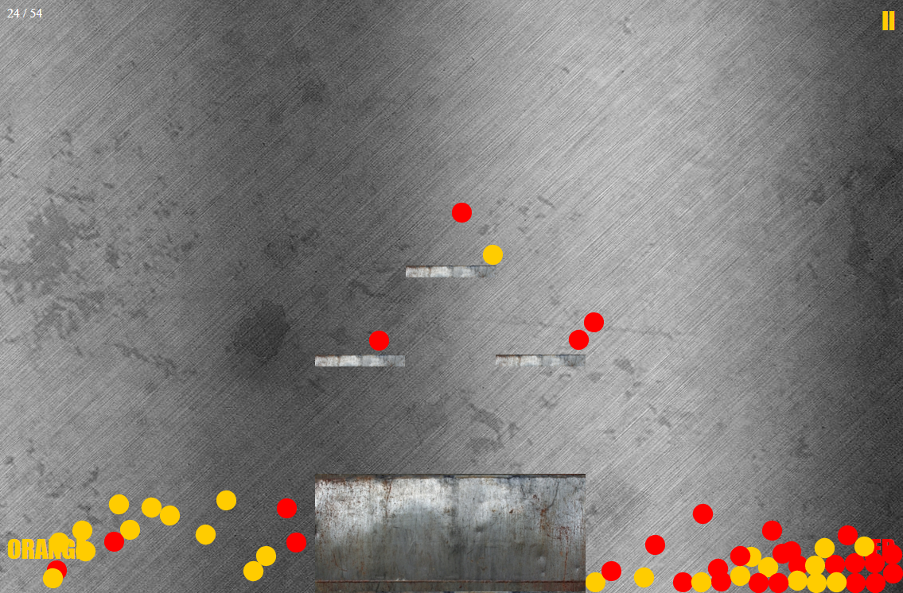

# The Gravity Balls

The Gravity Balls is a primitive game that uses real world physical elements such as gravity, force and acceleration. Your task is to accumulate all the yellow balls on one side and all the red on the other. You can control the game using the gyroscope in your phone, or using the mouse (by moving to the left or right side of the screen) or by using the keyboard (the left and right arrow keys). The game is accompanied by music and other sounds. Please do not take seriously the graphics and design, it is only an experiment

# Technologies
 - JavaScript (jQuery, Box2d-jquery)
 - HTML5
 - CSS3

 I used Box2d - jQuery lib from  Franz Enzenhofe (see https://github.com/franzenzenhofer/box2d-jquery)
